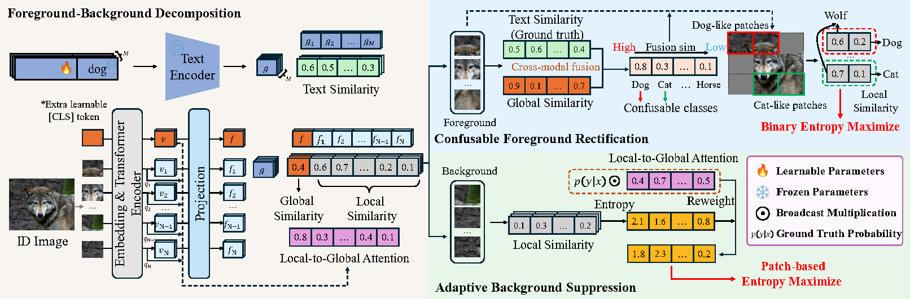

# FoBoR: Enhancing Few-Shot Out-of-Distribution Detection via the Refinement of Foreground and Background


## 📰 News

## 👁 Overview
***Foreground and Background Refinement***, a novel, parameter-free and plug-and-play framework, which consists of two components: Adaptive Background Suppression and Confusable Foreground Rectification. This aims to improve the robustness of models learning in-distribution (ID) features and enhance generalization to unseen OOD scenarios.

<p align="center">
  
</p>


## 🤯 Key Findings:
- **Pseudo-OOD samples**: There are pseudo-OOD outliers in the patches obtained based on foreground-background decomposition.
- **Background Patches**: In the background region, some background patches have a stronger statistical correlation with the true class of the sample, which means that it is not enough to simply use uniform entropy to destroy these background features.
- **Foreground Patches**: In the foreground region, some local patches are prone to uncertainty between the true and confused categories, which means that these patches can also be constructed as outliers.


## 🚀 Quick Start
### Installation 

```bash
# create conda environment
conda create -y -n fobor python=3.10.15 && conda activate fobor
# intall dependencies
pip install -r requirements
# install Dassl.pytorch
git clone https://github.com/KaiyangZhou/Dassl.pytorch.git && cd Dassl.pytorch/ && python setup.py develop
```
### Training
You need to specify `top_k` and `eta` for Adaptive Background Suppression, and `lambda`, `n_class`, and `n_patch` for Confusable Foreground Rectification. You also need to add balanced weights `alpha` and `beta` for both modules.
To train the model, use the `scripts/train.sh` script.
```bash
bash scripts/train.sh <trainer1> [trainer2 ...] <dataset> <cfg> <ctp> <nctx> <shots> <csc> <alpha_value> <beta_value> <eta_value> <n_class> <n_patch> <lambda_value> <top_k>
```

**Example:**
```bash
CUDA_VISIBLE_DEVICES=1 bash scripts/train.sh \
    LoCoOpCoCo SCTCoCo MamboCoCo \
    imagenet \
    vit_b16_ep30 \
    end 16 16 False \
    0.2 3.0 5.0 1 1 0.17 200
```

### Evaluation

To evaluate the model, use the `scripts/eval.sh` script.

```bash
bash scripts/eval.sh <trainer1> [trainer2 ...] <dataset> <cfg> <ctp> <nctx> <shots> <csc> <alpha_value> <beta_value> <eta_value> <n_class> <n_patch> <lambda_value> <top_k>
```

**Example:**
```bash
CUDA_VISIBLE_DEVICES=1 bash scripts/eval.sh \
    LoCoOpCoCo SCTCoCo MamboCoCo \
    imagenet \
    vit_b16_ep30 \
    end 16 16 False \
    0.2 3.0 5.0 1 1 0.17 200
```


## 🙇‍♂️ Acknowledgement
We appreciate the following papers for their open-source code:
* [LoCoOp: Few-Shot Out-of-Distribution Detection via Prompt Learning](https://github.com/AtsuMiyai/LoCoOp)
* [SCT: Self-Calibrated Tuning of Vision-Language Models for Out-of-Distribution Detection](https://github.com/warriors-30/SCT)
* [Mambo: Background Prompt for Few-Shot Out-of-Distribution Detection](https://github.com/YuzunoKawori/Mambo)

We also thank the [Dassl.pytorch](https://github.com/KaiyangZhou/Dassl.pytorch) framework for its valuable contribution.

## ✍️ Citation
If you find our work helpful, please cite as:

```
...
```